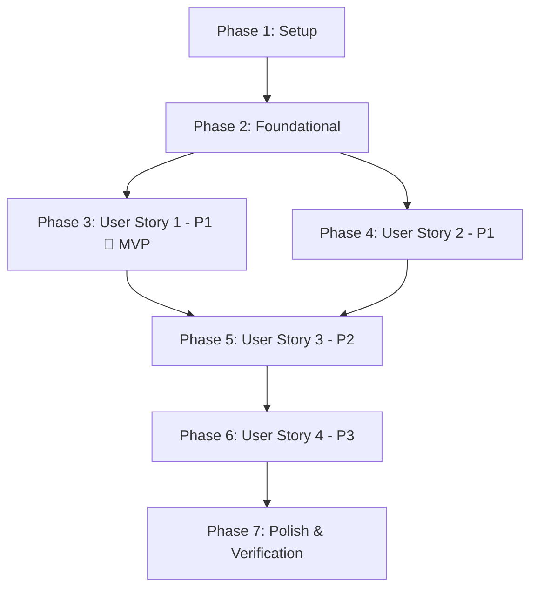

# Tasks: Application Optimization & Architecture Modernization

**Branch**: `001-optimize-app-architecture` | **Date**: 2026-09-04 | **Spec**: [spec.md](spec.md) | **Plan**: [plan.md](plan.md)

---

## Phase 1: Setup (Shared Infrastructure)

**Purpose**: Project initialization, static analysis cleanup, and shared styling foundation

- [X] T001 Verify Flutter and Dart SDK compatibility and project dependencies in `app/pubspec.yaml`
- [X] T002 [P] Fix static analysis lint warnings by replacing raw print statements with logger in `app/lib/data/api/api_client.dart`
- [X] T003 [P] Centralize design tokens, typography styles, and card surfaces in `app/lib/core/theme/app_theme.dart`

---

## Phase 2: Foundational (Blocking Prerequisites)

**Purpose**: Core database fixes, cryptographic test vector corrections, and test harness setup that MUST be complete before user stories

**⚠️ CRITICAL**: No user story work can begin until this phase is complete

- [X] T004 Defensively handle `repo_id` parameter binding in `AppDatabase.addToQueue` in `app/lib/data/database/app_database.dart`
- [X] T005 [P] Repair failing sync queue unit tests with valid repo identifiers in `app/test/database_test.dart`
- [X] T006 [P] Align Base32 decoding test vectors with RFC 4648 standards in `app/test/totp_engine_test.dart`
- [X] T007 [P] Align HOTP 8-digit test assertions with RFC 4226 Appendix D vectors in `app/test/totp_engine_test.dart`
- [X] T008 Refactor `AosaApp` initialization to accept test provider container overrides in `app/lib/main.dart`
- [X] T009 [P] Fix app launch test harness with test provider overrides in `app/test/widget_test.dart`

**Checkpoint**: Core database operations, cryptographic test assertions, and test harness are green. User story implementation can now begin.

---

## Phase 3: User Story 1 - Smooth, Real-Time Token Viewing & Interaction (Priority: P1) 🎯 MVP

**Goal**: Eliminate per-second full-tree rebuilds and card re-animation flickering, isolating timer updates to progress indicators so that 20+ accounts display and copy with 60fps smoothness.

**Independent Test**: Launch app with 20+ accounts in `HomeScreen`, observe 1-second countdown ticks; verify zero card re-entry animations/flicker and immediate one-tap copying.

### Tests for User Story 1

- [X] T010 [P] [US1] Create unit test verifying `OtpListNotifier` does not recreate account list on timer ticks in `app/test/otp_list_provider_test.dart`
- [X] T011 [P] [US1] Create widget test verifying `OtpCard` does not replay entrance fade-in animations on rebuild in `app/test/otp_card_widget_test.dart`

### Implementation for User Story 1

- [X] T012 [US1] Refactor `OtpListNotifier` to maintain immutable account lists without 1s full-list recreation in `app/lib/presentation/providers/otp_list_provider.dart`
- [X] T013 [P] [US1] Implement isolated second-level ticker provider in `app/lib/presentation/providers/totp_ticker_provider.dart`
- [X] T014 [US1] Refactor `OtpCard` to consume isolated ticker state and eliminate dynamic `fadeIn` on rebuild in `app/lib/presentation/widgets/otp_card.dart`
- [X] T015 [US1] Optimize `HomeScreen` `ListView.builder` to remove inline animations during timer ticks in `app/lib/presentation/screens/home_screen.dart`
- [X] T016 [US1] Add haptic and visual feedback on copy interaction in `app/lib/presentation/widgets/otp_card.dart`

**Checkpoint**: User Story 1 is functional: countdowns update second-by-second with zero full-list rebuilds and zero card animation flashing (MVP ready).

---

## Phase 4: User Story 2 - Resilient Data Management & Algorithmic Correctness (Priority: P1)

**Goal**: Ensure 100% mathematical precision across all RFC 6238 and RFC 4226 configurations (various digits, periods, algorithms) and safe persistence/queueing without database exceptions.

**Independent Test**: Import test tokens with 6/8 digits, SHA-1/256/512, and verify 100% correct code generation and error-free queueing.

### Tests for User Story 2

- [X] T017 [P] [US2] Add comprehensive RFC 6238 test vectors (SHA-1, SHA-256, SHA-512) in `app/test/totp_engine_test.dart`
- [X] T018 [P] [US2] Add edge-case test for Base32 secrets with spaces, hyphens, and missing padding in `app/test/totp_engine_test.dart`

### Implementation for User Story 2

- [X] T019 [US2] Ensure `TotpEngine` handles sanitized secret inputs, varying periods (10s to 300s), and 8-digit padding in `app/lib/domain/usecases/totp_engine.dart`
- [X] T020 [US2] Ensure `OtpauthParser` robustly extracts parameters with case-insensitive algorithms in `app/lib/domain/usecases/otpauth_parser.dart`
- [X] T021 [US2] Update `OtpRepositoryImpl` to pass active repo ID or designated default to `addToQueue` in `app/lib/data/repositories/otp_repository_impl.dart`

**Checkpoint**: User Stories 1 and 2 are functional: TOTP/HOTP generation is completely compliant with standards and offline database persistence never crashes.

---

## Phase 5: User Story 3 - Responsive, Multi-Screen Adaptive Views (Priority: P2)

**Goal**: Ensure the application adapts cleanly across mobile, tablet, and desktop screens without artificial portrait orientation locks, layout overflows, or stretched components.

**Independent Test**: Resize window from 360px mobile width to 1400px desktop width; verify centered adaptive layout and fluid navigation transitions.

### Tests for User Story 3

- [X] T022 [P] [US3] Create widget test for responsive layout constraints on mobile vs desktop widths in `app/test/home_screen_responsive_test.dart`

### Implementation for User Story 3

- [X] T023 [US3] Restrict `setPreferredOrientations` to mobile devices only using `AppPlatform.isMobile` in `app/lib/main.dart`
- [X] T024 [US3] Add adaptive max-width container (`maxWidth: 640px`) for wide-screen desktop displays in `app/lib/presentation/screens/home_screen.dart`
- [X] T025 [US3] Adapt bottom sheets and dialogs to render centered modal dialogs on desktop viewports in `app/lib/presentation/widgets/standard_bottom_sheet.dart`

**Checkpoint**: User Stories 1, 2, and 3 are functional: the app reflows smoothly between mobile phones, tablets, and wide desktop displays.

---

## Phase 6: User Story 4 - Consistent, Composable Component Design & Accessibility (Priority: P3)

**Goal**: Consolidate design tokens, eliminate inline font reallocations, provide real-time search filtering, and deliver accessible, consistent component surfaces across light and dark modes.

**Independent Test**: Search across accounts with instant filtering; toggle light and dark themes across dialogs, sheets, and home views.

### Tests for User Story 4

- [X] T026 [P] [US4] Create widget test verifying real-time search filtering and empty state display in `app/test/home_search_test.dart`

### Implementation for User Story 4

- [X] T027 [US4] Extract `HomeHeader` into a `const` widget using `AppTheme.headlineLarge` (no ad-hoc `GoogleFonts` allocations) in `app/lib/presentation/widgets/home_header.dart`
- [X] T028 [US4] Integrate `HomeHeader` and optimize `HomeSearchBar` with instant reactive filtering in `app/lib/presentation/screens/home_screen.dart`
- [X] T029 [US4] Harmonize dialogs, sheets, and action chips using centralized `AppTheme` radius and color tokens in `app/lib/presentation/widgets/aosa_widgets.dart`

**Checkpoint**: All 4 user stories are fully implemented and verified.

---

## Phase 7: Polish & Cross-Cutting Concerns

**Purpose**: Static analysis validation, test suite gate verification, and documentation updates

- [X] T030 [P] Run static analysis and verify 0 issues with `flutter analyze` in `app/`
- [X] T031 Run complete automated test suite and verify 100% passing tests with `flutter test` in `app/`
- [X] T032 [P] Update `app/README.md` with architecture documentation and testing instructions in `app/README.md`
- [X] T033 Execute full validation walkthrough following `specs/001-optimize-app-architecture/quickstart.md`

---

## Dependencies & Execution Order

### Phase Dependencies

- **Setup (Phase 1)**: Can start immediately.
- **Foundational (Phase 2)**: Depends on Setup completion. Blocks all user stories.
- **User Story 1 (Phase 3)**: Unlocks the primary MVP (smooth real-time rendering).
- **User Story 2 (Phase 4)**: Cryptographic engine and database sync safety. Can run in parallel with US1 once Foundational is complete.
- **User Story 3 (Phase 5)**: Responsive desktop/tablet view refactor.
- **User Story 4 (Phase 6)**: Component consolidation and search optimization.
- **Polish (Phase 7)**: Final quality gate (0 warnings, 100% green tests).

### Parallel Opportunities

- **Phase 1 Setup**: `T002` and `T003` can execute in parallel.
- **Phase 2 Foundational**: `T005`, `T006`, `T007`, `T009` can execute in parallel.
- **Phase 3 User Story 1**: `T010`, `T011`, and `T013` can execute in parallel.
- **Phase 4 User Story 2**: `T017` and `T018` can execute in parallel.
- **Phase 5 User Story 3**: `T022` can be written while `T023` executes.
- **Phase 6 User Story 4**: `T026` can be written while `T027` executes.
- **Phase 7 Polish**: `T030` and `T032` can run in parallel.

---

## Implementation Strategy

### MVP First (User Story 1 Only)
1. Complete **Phase 1: Setup** (T001 - T003).
2. Complete **Phase 2: Foundational** (T004 - T009) to make the test suite green.
3. Complete **Phase 3: User Story 1** (T010 - T016) to eliminate list rebuilds and card flickering.
4. **VALIDATE**: Run `flutter test` and check 60fps rendering in Flutter DevTools. Deliver MVP.

### Incremental Delivery
1. Foundation + US1 → Smooth 60fps MVP delivered.
2. Add US2 → Complete RFC 6238/4226 test vectors and zero database constraint issues.
3. Add US3 → Fluid desktop/tablet layout and window resizing.
4. Add US4 → Design token unification and instant search.
5. Final Polish → 0 analyzer warnings, 100% test pass, verified quickstart guide.
