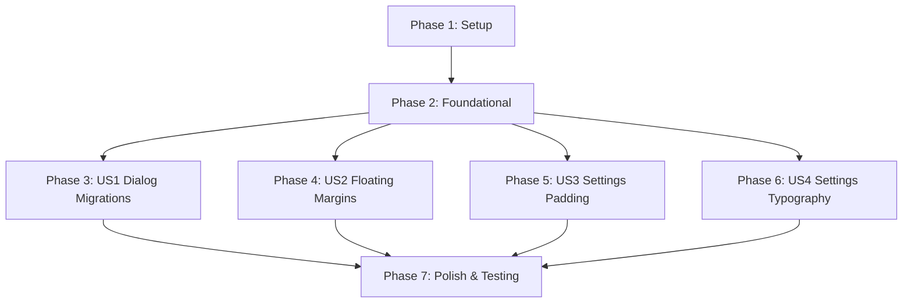

# Implementation Tasks: Standardize UI Design & Modal Presentation

**Feature**: `002-standardize-ui-design`
**Spec**: [specs/002-standardize-ui-design/spec.md](spec.md)
**Plan**: [specs/002-standardize-ui-design/plan.md](plan.md)
**Status**: Ready for Implementation

---

## Phase 1: Setup (Shared Infrastructure)

**Purpose**: Verify baseline test suite and review current modal dialog call sites.

- [X] T001 Verify project readiness and flutter test suite baseline in app/
- [X] T002 [P] Review current dialog and bottomsheet implementations in app/lib/presentation/widgets/

---

## Phase 2: Foundational (Blocking Prerequisites)

**Purpose**: Create shared bottom sheet presentation primitives required by all user stories.

**⚠️ CRITICAL**: Foundational components must be complete before modal migrations begin.

- [X] T003 Implement reusable ConfirmationBottomSheet component in app/lib/presentation/widgets/confirmation_bottom_sheet.dart
- [X] T004 [P] Update showSlideBottomSheet with transparent modal background and floating container styling in app/lib/presentation/widgets/standard_bottom_sheet.dart

**Checkpoint**: Core floating modal primitives ready for story integration.

---

## Phase 3: User Story 1 - Unified Bottom Sheet Presentation for All Modals (Priority: P1) 🎯 MVP

**Goal**: Replace all centered `showDialog` / `AlertDialog` invocations with slide-up bottom sheets.

**Independent Test**: Trigger each modal flow (Delete Account, Disconnect Cloud Sync, Create Repo, Option Picker, Accent Color Picker, Paste URI). Verify all appear as bottom sheets.

- [X] T005 [P] [US1] Refactor OptionPicker from Dialog to bottom sheet in app/lib/presentation/widgets/option_picker.dart
- [X] T006 [P] [US1] Update SettingsSelector to invoke showSlideBottomSheet with OptionPicker in app/lib/presentation/widgets/settings_helpers.dart
- [X] T007 [P] [US1] Refactor showConfirmDeleteDialog to use ConfirmationBottomSheet in app/lib/presentation/widgets/confirm_delete_dialog.dart
- [X] T008 [P] [US1] Migrate cloud sync disconnect dialog to ConfirmationBottomSheet in app/lib/presentation/screens/settings_sections/cloud_sync_section.dart
- [X] T009 [P] [US1] Migrate repo creation dialog to bottom sheet in app/lib/presentation/screens/settings_sheets/repo_manager_sheet.dart
- [X] T010 [P] [US1] Migrate AccentColorPicker from showDialog to bottom sheet in app/lib/presentation/screens/settings_sections/appearance_section.dart
- [X] T011 [US1] Migrate paste URI confirmation from AosaConfirmDialog to bottom sheet in app/lib/presentation/widgets/add_otp_bottom_sheet.dart

**Checkpoint**: All user-facing modal dialogs are now slide-up bottom sheets.

---

## Phase 4: User Story 2 - Floating Bottom Sheet Margins (Priority: P2)

**Goal**: Implement uniform left, right, and bottom margins (16dp) with rounded corners (28dp) on all four corners.

**Independent Test**: Open any bottom sheet on mobile and wide viewports. Verify 16dp margins from screen edges and 28dp rounded card corners.

- [X] T012 [US2] Add floating card padding (16dp left/right, 16dp bottom above safe area / viewInsets) in app/lib/presentation/widgets/standard_bottom_sheet.dart
- [X] T013 [P] [US2] Apply 4-corner rounded Material card (28dp radius) to StandardBottomSheet in app/lib/presentation/widgets/standard_bottom_sheet.dart
- [X] T014 [P] [US2] Apply floating card margins and 4-corner radius to ConfirmationBottomSheet in app/lib/presentation/widgets/confirmation_bottom_sheet.dart
- [X] T015 [US2] Update responsive maxWidth 640dp centering to account for floating margins in app/lib/presentation/widgets/standard_bottom_sheet.dart

**Checkpoint**: Bottom sheets render as floating cards on all supported screen sizes.

---

## Phase 5: User Story 3 - Comfortable Settings Row Padding (Priority: P3)

**Goal**: Increase SettingsRow horizontal padding from 4dp to 16dp and align dividers.

**Independent Test**: Open Settings. Verify icons and trailing controls maintain 16dp horizontal padding inside cards, and dividers align with the text column.

- [X] T016 [US3] Increase SettingsRow horizontal padding from 4dp to 16dp in app/lib/presentation/widgets/settings_helpers.dart
- [X] T017 [P] [US3] Update ThinDivider left indent to 66dp and right margin to 16dp in app/lib/presentation/widgets/settings_helpers.dart

**Checkpoint**: Settings card content has generous breathing room and properly aligned dividers.

---

## Phase 6: User Story 4 - Clear, Regular Typography in Settings (Priority: P4)

**Goal**: Enforce clear typography hierarchy with semi-bold titles (`w600`) and regular subtitles (`w400`).

**Independent Test**: Open Settings in Light and Dark themes. Verify text is easily readable with distinct regular and semi-bold contrast.

- [X] T018 [US4] Update SettingsRow title font weight to w600 (semi-bold) in app/lib/presentation/widgets/settings_helpers.dart
- [X] T019 [P] [US4] Update SettingsRow subtitle to w400 (regular) with full opacity in app/lib/presentation/widgets/settings_helpers.dart
- [X] T020 [P] [US4] Update SettingsSelector value label to w500 (medium) in app/lib/presentation/widgets/settings_helpers.dart
- [X] T021 [P] [US4] Audit and standardize font weights across settings sections in app/lib/presentation/screens/settings_sections/

**Checkpoint**: Settings typography is crisp, legible, and consistent across themes.

---

## Phase 7: Polish & Cross-Cutting Concerns

**Purpose**: Add automated regression tests, verify layout invariants, and run quality checks.

- [X] T022 Add widget tests for floating bottom sheet margins and corner radius in app/test/home_screen_responsive_test.dart
- [X] T023 [P] Add widget tests for ConfirmationBottomSheet and OptionPickerSheet in app/test/home_screen_responsive_test.dart
- [X] T024 [P] Add widget tests for SettingsRow 16dp padding and w600/w400 typography in app/test/home_screen_responsive_test.dart
- [X] T025 Run full test suite and flutter analyze in app/ to verify 0 warnings and 100% test pass rate

---

## Dependencies & Execution Order

### Phase Dependencies

### Parallel Execution Opportunities

- **Phase 3 (US1)**: Tasks T005, T006, T007, T008, T009, T010 can all be developed in parallel as they touch independent files.
- **Phase 4 (US2)**: Tasks T013 and T014 can run in parallel.
- **Phase 5 & 6 (US3 & US4)**: Settings padding and typography updates in `settings_helpers.dart` can be sequenced together cleanly.
- **Phase 7 (Polish)**: Tests T022, T023, T024 can be implemented and run concurrently before final verification T025.

---

## Implementation Strategy

### MVP Scope (User Story 1 + Foundational)
1. Complete Foundational primitives (T003, T004).
2. Migrate all dialogs to bottom sheets (T005–T011).
3. Validate that centered dialogs are 100% replaced.

### Incremental Delivery
1. Foundation & Dialog Migrations (US1) -> Clean mobile-first interaction pattern.
2. Floating Sheet Margins (US2) -> Modern card aesthetic across all screen viewports.
3. Settings Row Padding & Typography (US3, US4) -> Enhanced settings readability and breathing room.
4. Comprehensive Automated Tests & Quality Analysis (Polish) -> 100% passing tests with 0 analyzer issues.
