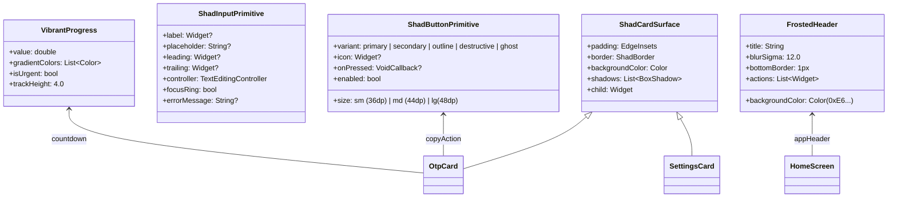

# Phase 1 Data Model: Unified Shadcn Component System & Component States

**Feature**: `006-complete-shadcn-rework`  
**Date**: 2026-09-12  
**Status**: Completed  

---

## 1. Entities & Presentation Models

### Entity: `ShadcnThemeConfiguration`
Encapsulates the design tokens and visual configuration used by the direct `shadcn_ui` framework and custom visual enhancements.

| Field | Type | Description |
| :--- | :--- | :--- |
| `themeMode` | `AppThemeMode` | Enum: `system`, `light`, `dark`. |
| `seedColor` | `Color` | User-selected dynamic accent (Emerald, Sky, Violet, Rose, Amber). |
| `canvasBackground` | `Color` | Dark: `0xFF09090B` (Zinc-950); Light: `0xFFF4F4F5` (Zinc-100). |
| `cardSurface` | `Color` | Dark: `0xFF18181B` (Zinc-900); Light: `0xFFFFFFFF` (Crisp White). |
| `borderOutline` | `Color` | Dark: `0xFF27272A` (Zinc-800); Light: `0xFFE4E4E7` (Zinc-200). |
| `glassmorphicSurface` | `Color` | Translucent frosted overlay (Alpha: `0xE6` / ~90% opacity). |
| `blurSigma` | `double` | Gaussian blur radius: `12.0` for frosted glass headers and sheets. |
| `borderRadius` | `double` | `radiusSm: 8.0`, `radiusMd: 12.0`, `radiusLg: 16.0`, `radiusCard: 20.0`. |

---

### Entity: `OtpCardDisplayState`
Represents the real-time presentation state of an individual OTP card in the list view.

| Field | Type | Description |
| :--- | :--- | :--- |
| `accountId` | `String` | Unique persistent identifier for the account. |
| `issuer` | `String` | Identity provider name (e.g. GitHub, Google, AWS). |
| `accountLabel` | `String` | User account label or email address. |
| `formattedCode` | `String` | Tabular monospace grouped digits (e.g., `123 456`). |
| `timeLeft` | `int` | Remaining seconds in the current TOTP period. |
| `totalPeriod` | `int` | Total period in seconds (default: 30). |
| `progressFraction` | `double` | Ratio `timeLeft / totalPeriod` driving the vibrant countdown bar. |
| `isUrgent` | `bool` | `true` when `timeLeft < 5s`, shifting countdown gradient to urgent fiery rose. |
| `isCopied` | `bool` | Transient state flag displaying the "Copied" badge and checkmark. |

---

### Entity: `ModalPresentationState`
Manages the responsive presentation of sheets, dialogs, and action modals.

| Field | Type | Description |
| :--- | :--- | :--- |
| `presentationMode` | `enum` | `dockedBottomDrawer` (<600dp width) vs `centeredPopover` (>=600dp width). |
| `title` | `String` | Modal header title. |
| `maxWidth` | `double` | Desktop boundary constraint: `640.0dp`. |
| `hasGrabHandle` | `bool` | `true` when rendered as mobile docked drawer. |
| `isDestructive` | `bool` | `true` for delete/destructive confirmations, tinting action button to destructive rose. |

---

## 2. Component Variant Hierarchy

---

## 3. State Transitions

### A. OTP Countdown & Urgency
1. `timeLeft` decrements every 1 second via `TickerProvider`.
2. `progressFraction = timeLeft / totalPeriod`.
3. When `timeLeft <= 5`, `isUrgent` transitions from `false` to `true`:
   - Countdown progress bar smoothly interpolates from user accent gradient to vibrant fiery rose (`#F43F5E` -> `#FB7185`).
4. When `timeLeft == 0`, new code is generated and `isUrgent` resets to `false`.

### B. One-Tap Copy Interaction
1. User taps OTP card or copy badge.
2. `isCopied` set to `true`, triggering haptic feedback (`HapticFeedback.lightImpact()`).
3. Clipboard receives unformatted raw digits.
4. "Copied" badge with `LucideIcons.check` displays for 1.5 seconds, then smoothly reverts to "Copy".
